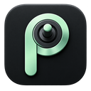

# Pilot Max

XP-Pen Pilot Proのボタン・ノブ・ダイアル・ジョイスティックに、アプリごとの操作を割り当てる常駐コントロールアプリです。

**初版は評価用です。** 最新の配布ファイルは [最新リリース](https://github.com/aktk-izuru/pilot-max-releases/releases/latest) から取得できます。このリポジトリでは、配布ファイル、インストール手順、更新情報を公開します。アプリのソースコードは非公開で管理しています。

## 対象環境

- Windows 11 x64
- macOS 26以降のApple Silicon
- 日本語 / English

## 機能

- ウィンドウ配置・全画面切り替え、キーコンビネーション、メディア操作、縦横スクロール、テキスト入力。
- 待機・回数指定の繰り返しを含むマクロ。
- 最前面のアプリに応じたプロファイル切り替え。macOSのWineではWindows側exeと任意のBottleを指定できます。
- 署名を検証した更新ファイルの自動取得と、ユーザー操作による適用・再起動。

## 配布と検証状況

配布ファイルは [Releases](https://github.com/aktk-izuru/pilot-max-releases/releases) に掲載します。インストール方法は [INSTALL.md](INSTALL.md) を参照してください。

現在、macOS 27の開発環境でUSBケーブル接続による全操作子の入力受信を確認しています。タッチ4ボタンでは単発イベントを受信しており、物理的な保持・解放は未確認です。受信機・Bluetooth、macOS 26、Windows実機は別途検証が必要です。各リリースの確認状況を必ず参照してください。

初版のWindowsインストーラーは未署名、macOSアプリはアドホック署名です。更新ファイルには、これとは別に検証用の署名を付けます。

## English

Pilot Max maps Pilot Pro controls to application-specific actions on Windows 11 x64 and Apple Silicon macOS 26+. It includes keyboard shortcuts, window layouts, media control, scrolling, Unicode text, macros, and automatic profiles including Wine executable/Bottle matching on macOS.

This repository hosts installers, installation instructions and signed update metadata. Source code is maintained privately. The initial release is for evaluation; USB reports have been captured on macOS 27, while receiver, Bluetooth, macOS 26 and physical Windows verification remain pending. Check each release's validation notes before installing.
